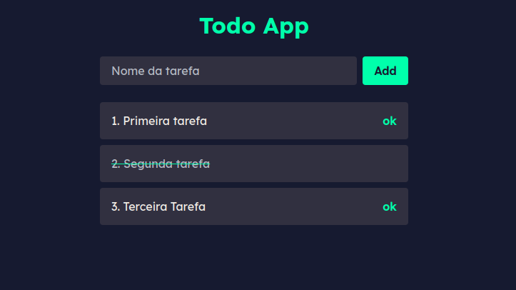

<h1 align="center"> DevLinks </h1>

Video tutorial do canal .  
<a href="https://www.youtube.com/watch?v=XDFhY6sRov8">Estude esse projeto em formato de vídeo clicando aqui.</a>

  <a href="#-tecnologias">Tecnologias</a>&nbsp;&nbsp;&nbsp;|&nbsp;&nbsp;&nbsp;

  

 

  

## 🚀 Tecnologias

Esse projeto foi desenvolvido com as seguintes tecnologias:

- Reacjs e CSS
- Git e Github

## 💻 Projeto

O Guia para começar a estudar REACJS.

- [Tutorial Video](https://www.youtube.com/watch?v=XDFhY6sRov8)
